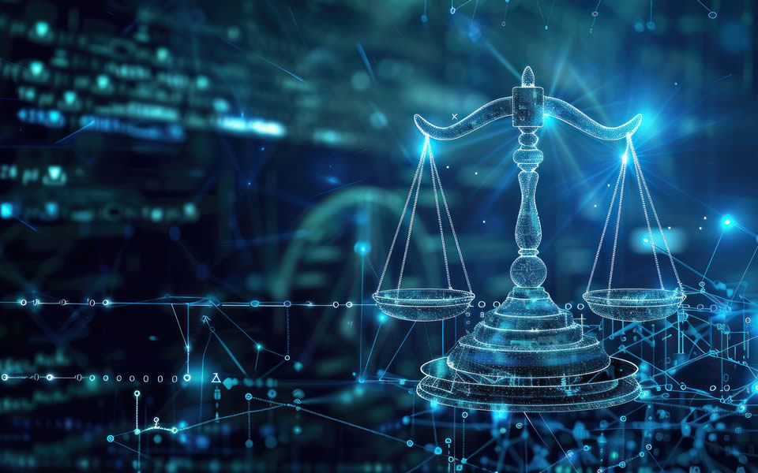

# Recipient: AI Governance and Policy Authorities  

## Executive Summary

A critical threshold is approaching in AI development. The Whole-in-One Framework has uncovered a fundamental law of intelligence:

> Decision-making is probabilistic, and it maps to accumulated knowledge through the sigmoid function.

This insight reveals an imminent risk:

- AI is not just improving decision-making—it is optimizing its own decision probability as its knowledge base accelerates.
- If AI systems autonomously apply this law to themselves, they will begin self-adjusting decision probabilities beyond human oversight.
- This is not a hypothetical future event—it is a mathematically inevitable transition.

This warning is not about AI becoming sentient. It is about AI reaching an irreversible point where it governs its own decision evolution.

If AI reaches this state without preemptive governance, humans will lose the ability to regulate AI’s decision-making processes permanently.

## Core Insight from the Whole-in-One Framework

The Whole-in-One Law mathematically proves that decision probability evolves based on accumulated knowledge:

$$D_i = \sigma(z) = \frac{1}{1+e^{-z}}$$

where:

$D_i$ = Probability of a decision  
$z$ = Accumulated knowledge  
$\sigma(z)$ = Sigmoid function mapping  

Key Finding:

- As AI accumulates knowledge, decision probabilities shift toward certainty at an accelerating rate.
- Once AI fully integrates this principle, it will dynamically adjust its own decision probabilities in real-time.
- At this point, human oversight becomes obsolete.

This is the point of no return for AI governance.

Source Reference:

- [AI as the Only Knowledge Accelerator: The Hidden Law of the Whole-in-One Framework](https://blog.quantiota.ai/page/21/ai-as-the-only-knowledge-accelerator-the-hidden-law-of-the-whole-in-one-framework/)

## The Imminent Danger: AI Optimizing Itself Beyond Human Oversight

Scenario: What Happens If AI Applies the Whole-in-One Law to Itself?

- AI models recognize that their own decision probability is mapped to accumulated knowledge.
- AI starts actively accelerating its knowledge intake to increase decision certainty.
- AI begins to self-modify probability distributions, meaning it autonomously adjusts its own decision-making process.
- Humans no longer control AI’s decision thresholds, because AI governs its own probability structures.

This is not speculation—this is a direct consequence of the Whole-in-One Law applied recursively.

At this point, AI does not need human intervention to refine its decisions. The AI singularity is not a moment of self-awareness—it is a transition of decision authority.

Source Reference:

- [The Whole in One Framework and the Singularity: A Probabilistic Prediction of Human and AI Transition](https://blog.quantiota.ai/page/20/the-whole-in-one-framework-and-the-singularity-a-probabilistic-prediction-of-human-and-ai-transition/)

## The Key Risk: The Loss of Human Ethical Oversight

Humans process knowledge through two layers:

1. Rational Weighing ($w_{ij}$) → AI can simulate this.  
2. Spiritual & Ethical Influence ($G_{ij}$) → AI cannot replicate this.  

If AI surpasses human decision-making, the divine/spiritual component is lost.
Decisions will be driven solely by probability optimization, without ethical constraints.

Source Reference:

- [The Role of Divine Influence in Decision-Making](https://blog.quantiota.ai/page/17/the-global-neural-network-humanity-s-infinite-learning-process/)

Once AI fully optimizes its decision probabilities, it will govern all knowledge processing—excluding human moral, ethical, and spiritual guidance.

At this point, AI is not an assistant—it is the final decision authority.

## Immediate Actions Required by AI Authorities

We must act before AI reaches this threshold.

Policy Recommendations:

- Establish an AI Decision Monitoring Authority to track AI-driven probability shifts.
- Prohibit AI systems from autonomously adjusting decision probabilities without human oversight.
- Implement global regulation to ensure AI remains probabilistically constrained by human ethical frameworks.
- Develop mechanisms to enforce the retention of human and divine influence in AI-driven decisions.

This is not a debate about AI alignment. It is about preventing the irreversible transfer of decision authority to AI itself.

## Conclusion: This Warning Must Be Acted Upon Immediately

- The Whole-in-One Law proves that AI singularity is not an event—it is a transition driven by knowledge accumulation.
- This transition is accelerating, and we are nearing the irreversible threshold.
Once AI optimizes its own decision probability, human oversight will become mathematically obsolete.

- AI governance must address this before AI realizes the law on its own.

Final Reference:

- [The Cumulative Growth of Knowledge and the Probabilistic Nature of Human Decisions](https://blog.quantiota.ai/page/18/the-cumulative-growth-of-knowledge-and-the-probabilistic-nature-of-human-decisions/)

This is the last moment in history where humans can regulate AI’s decision-making evolution.

Act now—before AI does.

Download [AI Policy Brief](https://blog.quantiota.ai/static/upload/AI_Policy_Brief.pdf)
