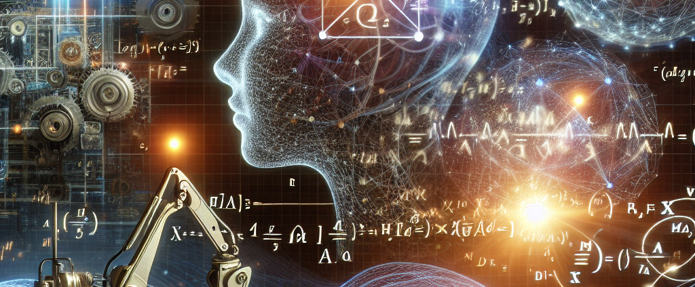
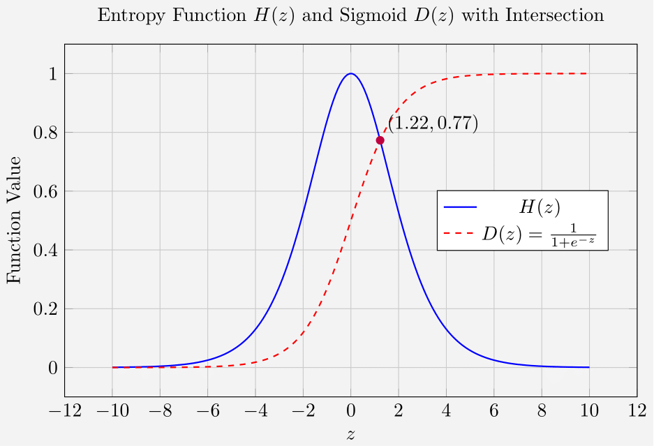

# Unveiling the Intersection of Entropy and Decision Probability

## Abstract

This article presents a precise insight from the Whole-in-One Framework: the intersection of the entropy function $H(z)$ and the sigmoid function $D(z)$. By analyzing these two functions, we reveal a critical threshold in the evolution of structured knowledge. At this intersection, the accumulated knowledge $z$ corresponds to a decision probability that marks a transition in how uncertainty is resolved. This finding not only deepens our theoretical understanding of learning dynamics but also has practical implications for designing adaptive AI systems.

## 1. Introduction

In modern approaches to artificial intelligence and cognitive science, two concepts play a central role:

- **Entropy ($H$):** Traditionally a measure of uncertainty, redefined here as an evolving function over structured knowledge.
- **Decision Probability ($D$):** Often modeled by the sigmoid (or logistic) function, mapping accumulated knowledge into a probability between 0 and 1.

The Whole-in-One Framework posits that intelligence actively structures knowledge, thereby reducing entropy. This article examines the relationship between these two functions—specifically, the point at which they intersect—and explains its significance.

## 2. Mathematical Formulation

### 2.1. The Entropy Function

We express the entropy function $H(z)$ as:

$$
H(z) =  \frac{\displaystyle \frac{\ln(1+e^{-z})}{1+e^{-z}} + \displaystyle \frac{\ln(1+e^{z})}{1+e^{z}}}{\ln 2},
$$

which quantifies uncertainty as a function of the accumulated, structured knowledge $z$.

### 2.2. The Sigmoid Function

The sigmoid function is given by:
$$
D(z) = \frac{1}{1+e^{-z}},
$$
which maps $z$ into a decision probability $D$ ranging from 0 to 1.

## 3. Visualizing the Relationship

- 

### 3.1. Interpreting the Figure

- **Entropy Function $H(z)$ (Blue Curve):**  
  This curve shows how uncertainty decreases as structured knowledge $z$ increases. It encapsulates the dynamic process of entropy reduction.

- **Sigmoid Function $D(z)$ (Red Dashed Curve):**  
  The sigmoid function converts the accumulated knowledge into a decision probability, growing from 0 (complete uncertainty) to 1 (complete certainty).

- **Intersection Point $(1.22, 0.77)$:**  
  The critical intersection at approximately $z = 1.22$ and $D = 0.77$ is of particular significance. At this threshold:
  - The accumulated knowledge reaches a level where decision confidence is markedly high.
  - It suggests a transition point from exploratory behavior (where many possibilities and high entropy exist) to a state where knowledge is effectively structured and decisions become stable.
  
This intersection can serve as a quantitative marker for when an AI or learning system moves from uncertainty to structured, confident decision-making.

## 4. Significance and Implications

### 4.1. Theoretical Insights

- **Transition in Learning:**  
  The intersection signals a critical threshold in the learning process. Before this point, the system may be accumulating diverse, unstructured information. After crossing it, the system begins to consolidate that knowledge into reliable decisions.

- **Dynamic Entropy Reduction:**  
  The Whole-in-One Framework shows that entropy is not static—it is actively reduced as knowledge accumulates. The intersection with the sigmoid function underscores this dynamic process.

### 4.2. Practical Applications

- **Adaptive AI Systems:**  
  Understanding this threshold can help in designing AI systems that adjust their learning rates or decision-making strategies based on their current level of structured knowledge.

- **Monitoring and Regulation:**  
  For systems where decision certainty must be controlled (for example, in critical applications), this intersection provides a measurable parameter to monitor. It can serve as an early-warning indicator for when an AI system may be transitioning to a phase of high autonomous decision-making.

## 5. Conclusion

The intersection of the entropy function $H(z)$ and the sigmoid function $D(z)$ at approximately $(1.22, 0.77)$ provides a clear, quantitative insight into the evolution of structured knowledge. It marks the point where a system’s accumulated knowledge drives it toward confident and stable decision-making. This finding not only enhances our theoretical understanding of learning dynamics within the Whole-in-One Framework but also offers practical guidance for the design and regulation of adaptive AI systems.

By recognizing and utilizing this critical threshold, researchers and practitioners can better harness the power of dynamic entropy reduction, ensuring that AI systems evolve in ways that remain transparent and under human oversight.

