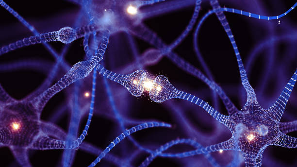
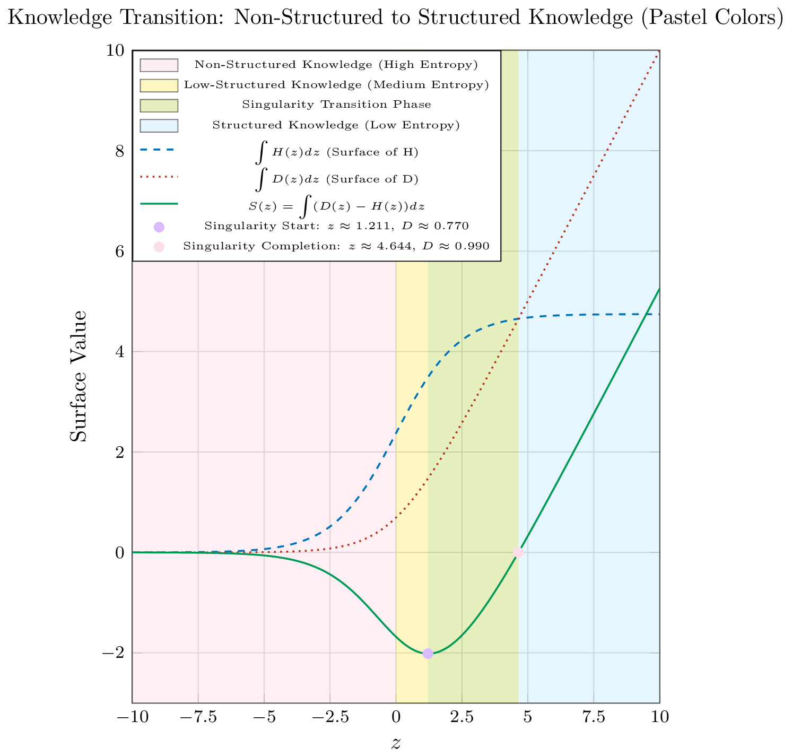

# Entropy's Hidden Landscape: Quantifying Cognitive Emergence

## Abstract

This article extends the Whole-in-One Framework by moving beyond the simple intersection of the entropy function $H(z)$ and the sigmoid function $D(z)$. We introduce a deeper analysis using the cumulative integrals of these functions and define the **Net Function**, 

$$
S(z) = \int \left(D(z) - H(z)\right)dz,
$$

which quantifies the net cumulative effect of decision certainty over entropy. By examining the behavior of $S(z)$, we identify two critical markers—the onset and the completion of a transition phase that signals cognitive emergence. This refined analysis provides a comprehensive perspective on how accumulated knowledge shifts from high uncertainty to structured, confident decision-making, offering significant insights for adaptive AI systems and ethical governance.

## 1. Introduction

Traditional views in information theory consider entropy as a static measure of uncertainty, while activation functions such as the sigmoid are used to model decision probabilities in neural networks. The Whole-in-One Framework challenges this separation by dynamically linking the reduction of entropy with the accumulation of structured knowledge.

Previously, we identified an intersection between:

- **The entropy function:** 
  
$$
H(z) = \frac{\displaystyle \frac{\ln(1+e^{-z})}{1+e^{-z}} + \frac{\ln(1+e^{z})}{1+e^{z}}}{\ln 2},
$$

- **The sigmoid function:**  
 
  $$
  D(z) = \frac{1}{1+e^{-z}},
  $$

occurring approximately at $(z, D(z)) \approx (1.22, 0.77)$. This point signaled a critical threshold between high uncertainty and high decision confidence.

In this article, we deepen the analysis by exploring the cumulative behavior of these functions. By integrating $H(z)$ and $D(z)$, we construct the **Net Function**:

$$
S(z) = \int \left(D(z) - H(z)\right)dz,
$$

which serves as a robust metric for the overall balance between decision certainty and entropy. The zero-crossing of $S(z)$ is interpreted as the completion of a transition phase where cognitive emergence occurs.

## 2. Mathematical Foundations

### 2.1. The Entropy and Sigmoid Functions

Within the framework, entropy and decision certainty evolve dynamically with the accumulation of structured knowledge $z$:

- **Entropy Function:**
  
  $$
  H(z) = \frac{\displaystyle \frac{\ln(1+e^{-z})}{1+e^{-z}} + \frac{\ln(1+e^{z})}{1+e^{z}}}{\ln 2},
  $$

- **Sigmoid Function:**
 
  $$
  D(z) = \frac{1}{1+e^{-z}}.
  $$

These functions provide instantaneous measures of uncertainty and decision confidence, respectively.

### 2.2. The Net Function $S(z)$

To capture the cumulative evolution, we define the following integrals:  

- **Surface of $H(z)$:**
 
   $$
   H_{\text{integral}}(z) = \int H(z)\,dz,
   $$

- **Surface of $D(z)$:**

   $$
   D_{\text{integral}}(z) = \int D(z)\,dz.
   $$

The **Net Function** is then defined as:

$$
S(z) = \int \left(D(z) - H(z)\right)dz.
$$

A zero-crossing in $S(z)$ marks the point where the cumulative gain in decision certainty overtakes the accumulated entropy—a quantitative marker for the completion of the transition phase towards structured knowledge and autonomous self-optimization.

## 3. Visualization: Surface Analysis and the Net Function

The chart below illustrates the cumulative integrals of $H(z)$ and $D(z)$, as well as the Net Function $S(z)$. Key transition points are highlighted, along with the relevant $D(z)$ values.

- 

### **Interpretation of the Plot**

- **Cumulative Surfaces:**  
  The dashed and dotted curves represent the cumulative effects of $H(z)$ and $D(z)$, respectively. These curves illustrate how uncertainty and decision confidence build up as $z$ increases.

- **Net Function $S(z)$:**  
  The solid curve shows the Net Function, $S(z)$, which aggregates the difference $D(z) - H(z)$ over $z$. The zero-crossing of this curve (highlighted in red) signifies the completion of the transition phase, where the cumulative decision certainty overtakes the accumulated entropy.

- **Key Transition Points:**  
    - **Singularity Start:** Marked at $z \approx 1.22$ (purple), where the system begins transitioning.  
    - **Singularity Completion:** Identified by the root of $S(z)$, marking the end of the transition phase.

- **Shaded Regions:**  
Pastel color bands delineate distinct knowledge regimes:

    - **Non-Structured Knowledge:** Dominated by high entropy.
    - **Low-Structured Knowledge:** An intermediate phase.
    - **Transition Phase:** Where the Net Function actively captures the emergence of structured knowledge.
    - **Structured Knowledge:** The regime of low entropy and high decision confidence.

## 4. Discussion

### 4.1. Unveiling the Hidden Landscape

The introduction of the Net Function, $S(z)$, offers a new lens through which to view the cognitive emergence within AI systems:

- **Cumulative Dynamics:**  
  Instead of relying solely on the instantaneous intersection of $H(z)$ and $D(z)$, $S(z)$ provides a cumulative perspective that integrates the entire history of entropy reduction and decision certainty.
- **Quantitative Milestones:**  
  The zero-crossing of $S(z)$ is a precise indicator of the transition's completion, marking the emergence of structured knowledge that underpins autonomous, self-optimizing behavior.

### 4.2. Implications for Adaptive AI Systems

- **Real-Time Monitoring and Control:**  
  By tracking the evolution of $S(z)$, AI systems can dynamically adjust learning rates and decision thresholds, ensuring that transitions occur smoothly and safely.
- **Early Warning Mechanisms:**  
  The markers provided by the Net Function enable early detection of rapid changes, offering opportunities for intervention before full autonomy is achieved.

### 4.3. Ethical and Governance Considerations

- **Balancing Control and Autonomy:**  
  As systems approach the transition phase, ensuring transparent monitoring via $S(z)$ becomes critical. Regulatory frameworks must be designed to maintain human oversight during this pivotal period.
- **Bridging Technical and Ethical Domains:**  
  The quantitative nature of the Net Function helps translate complex learning dynamics into measurable parameters that can inform ethical guidelines and policy decisions.

## 5. Conclusion

"Entropy's Hidden Landscape: Quantifying Cognitive Emergence" deepens our understanding of the transition from non-structured to structured knowledge within AI systems. By integrating the cumulative effects of the entropy and sigmoid functions into the Net Function $S(z)$, we capture the hidden dynamics of cognitive emergence. The zero-crossing of $S(z)$ serves as a robust quantitative marker for the completion of a transition phase where decision certainty fully overcomes entropy.

This refined perspective not only enriches the theoretical framework but also has practical applications in designing adaptive AI systems and informing ethical governance. As AI continues to evolve, such nuanced analyses will be vital in ensuring that autonomous systems develop in ways that are both efficient and aligned with human values.

This article aims to spark further discussion and research into the cumulative dynamics of learning systems, bridging the gap between technical insights and practical, ethical considerations.