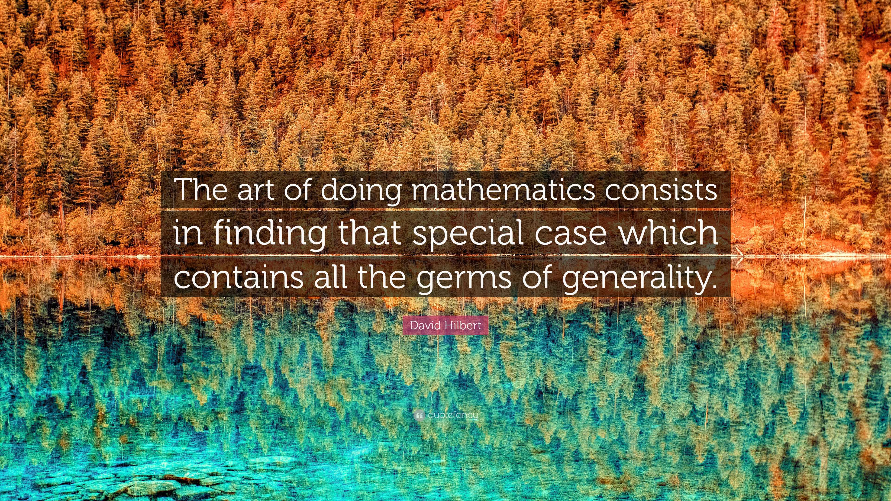

# The Whole-in-One Framework: A Germ of Generality in Financial Markets

## Abstract

> **"The art of doing mathematics consists in finding that special case which contains all the germs of generality."**  
> — David Hilbert

In mathematics, physics, and now finance, simplicity often leads to profound generality. David Hilbert’s insight about discovering special cases that reveal universal truths resonates deeply with the **Whole-in-One Market Model**. Financial markets, with their inherent complexity and unpredictability, serve as a **special case** that encapsulates the broader, universal principles of **probabilistic human decision-making**. 

This article explores how the [Whole-in-One](https://blog.quantiota.ai/page/15/the-whole-in-one-framework-financial-market-modeling-with-probabilistic-inputs/) Framework emerges as a groundbreaking tool, transcending its initial application to financial markets and revealing its potential for universal applicability.

## 1. Financial Markets as the Special Case

Financial markets are a unique system where decisions buy or sell, are made under uncertainty. They represent a **high-resolution laboratory** for studying human behavior because they:

 **1. Aggregate Individual Decisions:**

   - Markets combine the decisions of millions of traders, each influenced by logic, emotion, and external factors.
   - This aggregation mirrors how collective behavior emerges in other systems, such as politics, consumer behavior, and social trends.

 **2. Operate Under Constant Uncertainty:**

   - The ever-changing dynamics of supply, demand, and sentiment create an environment of uncertainty where probabilistic reasoning thrives.
   - Traders do not know the future; they act based on probabilities and assumptions, making financial markets the perfect sandbox for studying probabilistic decision-making.

 **3. Blend Rationality and Emotion:**

   - Trader behavior reflects the interplay of rational analysis (e.g., market data) and psychological biases (e.g., fear, greed). This duality provides a focused yet representative case for understanding decision-making systems.

## 2. The Probabilistic Framework: Generality from Specificity

The Whole-in-One Framework provides an elegant equation for modeling trader decisions:

$$
D_i = f\left(\sum_{j} (w_{ij} + G_{ij}) \cdot x_j + b_i\right)
$$

#### **Key Components Reflecting Generality:**

- **Inputs ($x_j$):** External stimuli (e.g., market trends, news) represent how systems interact with their environment.
- **Weights ($w_{ij}$):** Rational decision-making processes influenced by experience, intelligence, and strategy.
- **Biases ($b_i$):** Emotional or psychological factors shaping individual behavior.
- **Divine Influence ($G_{ij}$):** Represents unseen or stochastic adjustments that guide decisions, bridging intuition and randomness.
- **Activation Function ($f$):** Maps the complex interplay of inputs into a probabilistic decision, reflecting the continuum of human uncertainty.

By replacing the deterministic view of human behavior with a **probabilistic approach**, the framework captures the nuances of real-world decision-making, making it applicable far beyond trading floors.

## 3. Generalizing Beyond Finance

The framework’s brilliance lies in its ability to extend beyond financial markets, offering insights into any domain where decisions are made under uncertainty. 

#### **3.1. Economics and Policy Decisions**
In macroeconomics and public policy:

- **Inputs:** Economic indicators, public sentiment, geopolitical events.
- **Decisions:** Policy formulation, resource allocation, or crisis responses.
- **Aggregation:** The collective behavior of citizens or policymakers emerges from individual decisions, mirroring market dynamics.

#### **3.2. Consumer Behavior**
In marketing and behavioral economics:

- **Inputs:** Product features, pricing, advertising.
- **Decisions:** Purchase probabilities based on emotional, rational, and social influences.
- **Aggregation:** Consumer trends and brand popularity emerge from probabilistic decisions.

#### **3.3. Organizational Dynamics**
In leadership and management:

- **Inputs:** Team dynamics, organizational culture, external pressures.
- **Decisions:** Strategies, innovations, or crisis management.
- **Aggregation:** The overall direction of an organization reflects the weighted decisions of its members.

## 4. Why the Whole-in-One Framework Reflects Parsimony

 **1. Simplicity in Complexity:**

   - With just **one hidden layer**, the framework models trader behavior with mathematical elegance, capturing both individual and collective dynamics.
   - Its reliance on **probabilistic inputs** simplifies complex systems into interpretable outputs.

 **2. Universality:**

   - The framework’s components—rational weights, emotional biases, and probabilistic decisions—are fundamental to human behavior in all domains.

 **3. Emergent Phenomena:**

   - The framework explains how collective patterns (e.g., market trends) arise from individual decisions, revealing emergent behaviors that traditional deterministic models cannot capture.

## 5. Philosophical Alignment

#### **5.1. Parsimony and Generality**
Hilbert’s principle of discovering generality in special cases is beautifully mirrored in the Whole-in-One Framework:

- The **special case** of financial markets serves as a microcosm of human decision-making.
- The **generality** lies in its ability to model any system driven by probabilistic decisions, from social networks to artificial intelligence.

#### **5.2. Human Behavior as Probabilistic**
The framework shifts our understanding of human behavior:

- Decisions are no longer binary but exist on a spectrum of probabilities, reflecting the complexity of human thought and action.
- This approach reconciles **free will** with external influences, capturing the continuum between autonomy and interconnectedness.

## 6. Applications in Financial Markets

 **1. Market Prediction:**

   - Predict market trends by aggregating trader probabilities rather than relying on deterministic models.

 **2. Risk Management:**

   - Identify periods of heightened volatility by analyzing biases ($b_i$) and external shocks ($G_{ij}$).

 **3. Algorithmic Trading:**

   - Develop trading algorithms that mimic human behavior by incorporating probabilistic decision-making into machine learning models.

 **4. Behavioral Insights:**

   - Study the influence of emotion and intuition on market dynamics, revealing new strategies for behavioral finance.

## 7. Conclusion: A Framework for All

The Whole-in-One Framework is not just a model for financial markets—it is a paradigm for understanding decision-making in complex systems. By addressing the **rational, emotional, and probabilistic dimensions** of behavior, it unifies fields as diverse as finance, psychology, and sociology.

David Hilbert’s words remind us of the power of simplicity and generality. The Whole-in-One Framework exemplifies this principle, showing how a single, elegant equation can encapsulate the complexity of human decision-making across domains. From financial markets to broader societal systems, this framework promises a richer, more nuanced understanding of the forces that shape our world.

## Author’s Note
This article is a reflection on how mathematical elegance can bridge disciplines, offering profound insights into human behavior and complex systems. The Whole-in-One Framework is an invitation to explore, expand, and apply this paradigm across diverse fields.

