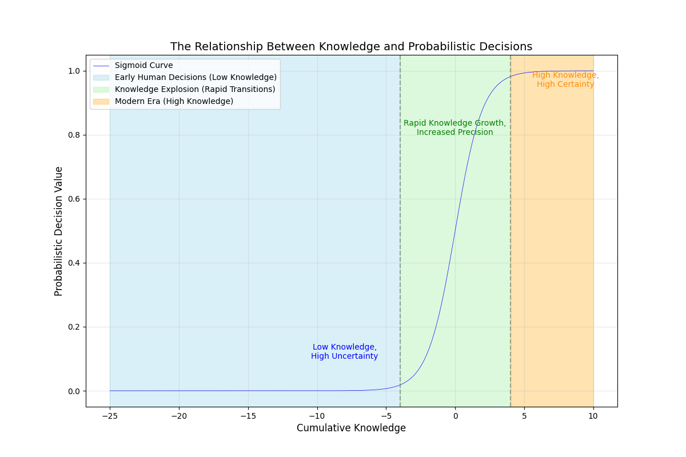

# The Cumulative Growth of Knowledge and the Probabilistic Nature of Human Decisions

## Abstract

This article explores the profound correlation between the growth of cumulative human knowledge and the evolution of probabilistic decision-making, as modeled by the sigmoid function within the [Whole-in-One ](https://blog.quantiota.ai/page/17/the-global-neural-network-humanity-s-infinite-learning-process/)Framework. Since the dawn of humanity, every step forward in knowledge has refined and expanded the probabilistic nature of decisions, leading to increasingly precise and impactful outcomes. This relationship not only provides a fresh lens through which to view human history but also integrates the logistic function as a cornerstone of understanding the collective progression of humanity.

## 1. Introduction

Humanity's story is one of continuous learning, adaptation, and decision-making. From primitive survival decisions to the sophisticated choices that shape our modern world, the cumulative growth of knowledge has fundamentally influenced how humans make decisions. This article posits that the **sigmoid function**, initially conceived as a mathematical tool, serves as a profound representation of this evolutionary process.

By mapping the sigmoid function to humanity’s collective decision-making process, we reveal that the increase in knowledge over millennia has not only expanded the range of probabilistic decisions but also improved the clarity and precision of those decisions. This connection bridges abstract mathematical modeling with the tangible realities of human progress.

## 2. The Sigmoid Function: A Symbol of Knowledge and Decision-Making

The sigmoid function is a logistic curve defined as:

$$
\sigma(x) = \frac{1}{1 + e^{-x}}
$$

### Key Features of the Sigmoid Function

1. **Probability Mapping:** The sigmoid maps input values to a probability range between 0 and 1, representing the likelihood of a decision outcome.
2. **Nonlinearity:** The steep central region models rapid transitions as input knowledge reaches critical thresholds.
3. **Boundaries:** The asymptotes (≈0 and ≈1) reflect decision uncertainty (low knowledge) and near-certainty (high knowledge).

In the context of humanity, the sigmoid function encapsulates how the accumulation of knowledge refines decisions, shifting them from guesswork to calculated probabilities.

## 3. The Relationship Between Knowledge and Probabilistic Decisions

### 3.1. Early Human Decisions: Limited Knowledge, Low Certainty

In the earliest stages of human history, decisions were heavily influenced by survival instincts and trial-and-error learning. Knowledge was sparse, and uncertainty dominated decision-making. On the sigmoid curve, this corresponds to the lower, flatter region, where small increases in knowledge had minimal impact on decision clarity.

### 3.2. The Knowledge Explosion: Rapid Transitions

With the advent of agriculture, writing, science, and technology, humanity entered a phase of exponential knowledge growth. This corresponds to the steep middle region of the sigmoid curve, where incremental increases in knowledge significantly enhanced the precision of decisions. Societies began to:

- Predict outcomes with greater accuracy.
- Develop structured systems (e.g., governance, trade, and education).
- Solve increasingly complex problems.

### 3.3. Modern Era: High Knowledge, High Certainty

In today’s interconnected world, humanity operates near the upper asymptote of the sigmoid curve in many domains. While uncertainty still exists, decisions are often supported by vast amounts of data, advanced tools, and accumulated wisdom. This stage represents:

- High decision confidence.
- A deeper understanding of probabilities and outcomes.
- The ability to model, predict, and influence complex systems.

### 3.3. Visualization
The Relationship Between Knowledge and Probabilistic Decisions

## 4. The Whole-in-One Framework: Integrating Knowledge and Decisions

The Whole-in-One Framework models human decision-making as:

$$
\sigma \left(\sum_j (w_{ij} + G_{ij}) \cdot x_j + b_i \right) = D_i 
$$

### Components of the Equation

- **Inputs ($x_j$):** Represent cumulative knowledge and observed phenomena.
- **Weights ($w_{ij}$):** Capture the importance of specific knowledge to a given decision.
- **Bias ($b_i$):** Reflect emotional and contextual factors influencing decisions.
- **Divine Influence ($G_{ij}$):** Introduces the idea of subtle, higher-order adjustments guiding decisions.

This equation reflects how human decisions evolve with increasing knowledge. Early on, low weights and limited inputs result in decisions dominated by uncertainty. As knowledge accumulates, inputs and weights align to produce probabilities closer to certainty.

## 5. Implications of the Knowledge-Decision Correlation

### 5.1. A Universal Model for Human Progress

The sigmoid’s mapping of knowledge to decision probabilities offers a universal framework for understanding human advancement. It reveals that:

- Decisions improve as knowledge grows.
- Critical transitions occur during periods of rapid knowledge accumulation.
- Humanity’s progress is a function of both individual and collective learning.

### 5.2. Practical Applications

- **Financial Markets:** Decisions based on probabilistic inputs (e.g., market trends, sentiment) align with the framework, offering a dynamic model for prediction and risk management.
- **Education:** The sigmoid highlights the importance of critical thresholds in learning, where small efforts yield significant gains.
- **Policy-Making:** By focusing on knowledge growth, leaders can prioritize areas that drive societal progress.

## 6. Conclusion: Humanity’s Infinite Learning Process

The Whole-in-One Framework, powered by the sigmoid function, reveals a profound truth: the growth of cumulative knowledge underpins the refinement of human decision-making. This correlation, evident since the dawn of humanity, has driven progress across all domains of life.

By modeling decisions as probabilistic outcomes shaped by knowledge, weights, biases, and divine influence, the framework provides a unifying perspective on human behavior. It not only explains the past but also offers a roadmap for navigating the uncertainties of the future.

In this light, humanity’s journey can be seen as an infinite learning process—a global neural network continually refining itself, one decision at a time.

## Author’s Note

This article is a testament to the power of abstraction and the depth of the Whole-in-One Framework. It is both an invitation and a challenge to explore the intersections of knowledge, decision-making, and human progress in new and innovative ways.
