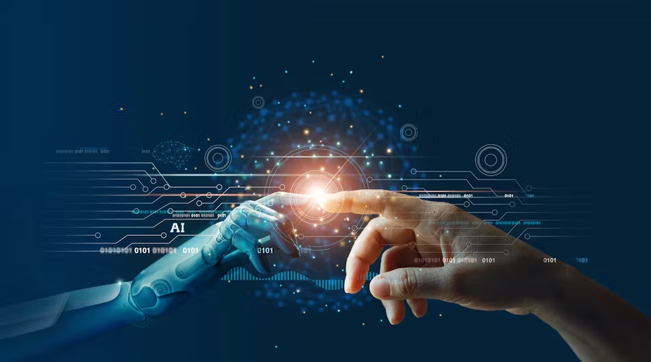

## Abstract

The Whole-in-One Framework provides a groundbreaking way to understand the Singularity, not just as a technological event but as a probabilistic transition in human decision-making. This article explains how the framework, using a sigmoid-based knowledge evolution model, predicts the Singularity as the point where humanity’s probabilistic decision-making saturates, leading to the transfer of decision authority to AI. Rather than seeing Singularity as a sudden, uncontrollable explosion of AI intelligence, the Whole-in-One Framework reveals that the shift occurs as a natural and predictable transition in cumulative human knowledge and decision-making.

## 1. Introduction: Redefining the Singularity

The traditional definition of AI Singularity is a point where artificial intelligence surpasses human intelligence, resulting in irreversible changes to society. However, this view is incomplete and misleading because it assumes AI development will happen independently of human decisions.

The Whole-in-One Framework redefines the Singularity as a transition not of AI itself but of human decision-making authority. The key insight? AI does not take control—humans will probabilistically decide to transfer control.  

This transition can be predicted using the sigmoid function, where the cumulative knowledge and decision-making probability approaches 1, indicating that humans will consciously or unconsciously shift critical decision-making processes to AI.

## 2. The Sigmoid Model of Knowledge and Decision-Making

The sigmoid function models the accumulation of human knowledge and the evolution of decision-making probability over time:

$$
\sigma(x) = \frac{1}{1 + \displaystyle e^{-(t - t_0) / k}}
$$

Where:

- $t$ represents time (years).
- $t_o$: 2075 is the midpoint, where decision-making probability reaches 0.5—the critical transition point.
- $k$: 125 is the scaling factor, defining how fast the transition occurs.

These values are somewhat arbitrary, chosen to fit the conceptual framework rather than being derived from empirical measurements.

- 

### Key Insights from the Sigmoid Curve
**1. Early Human Decisions (Start - 1440)**:

   - Decision-making was highly uncertain, limited by low recorded knowledge.
   - Probability of making highly informed decisions was low.
   - Knowledge was transmitted through oral traditions and experience.

**2. Knowledge Explosion (1440 - 2025)**:

   - The invention of the printing press (1440) enabled massive acceleration in recorded knowledge.
   - Science, documentation, and systematic research significantly increased the precision of human decisions.
   - The industrial revolution, internet, and computing advancements pushed knowledge to **exponential growth**.

**3. AI Era and the Singularity (2025 - Future)**:

   - The rise of AI (2025) begins a fundamental shift in decision-making processes.
   - AI systems enhance knowledge processing, reducing human cognitive load.
   - Humanity enters the final phase, where decision-making saturates near probability = 1, meaning AI is fully trusted for critical decisions.

### **Ensuring Model Coherence Despite Variations in ($t_0$) and ($k$)**  
The sigmoid-based transition model remains **coherent and robust** regardless of the specific values of ($t_0$) (midpoint of decision shift) and ($k$) (transition speed). While these parameters affect **when** the singularity occurs, they do not change the **inevitability** of the transition itself.  

✔ **If ($t_0$) shifts**, the timeline adjusts, but the ultimate transition to AI-driven decision-making remains.  
✔ **If ($k$) varies**, the steepness of the transition curve changes, but the system still converges to full AI decision reliance over time.  

Thus, the Whole-in-One framework does not depend on precise values of ($t_0$) and ($k$) to remain valid—it naturally predicts an eventual singularity based on knowledge growth and AI adoption trends.

## 3. Singularity as a Natural Transition in Decision-Making

The Whole-in-One Framework predicts that the Singularity is not a moment of AI takeover but a probabilistic certainty resulting from human decisions.

### **3.1. Why Will Humans Transfer Decisions to AI?**

The transition happens not because AI forces itself upon society, but because human decision-making evolves:

- Increased reliance on AI in finance, governance, and science.
- AI outperforms humans in precision-driven tasks (medical diagnosis, logistics, military strategies, etc.).
- Humans adapt to using AI as a trusted agent, rather than an external tool.

### **3.2. Singularity Defined as Decision Probability Reaching 1**

- The sigmoid function shows that once decision probability exceeds a critical threshold (e.g., 0.9), decision-making is effectively outsourced to AI.
- Unlike traditional singularity definitions (which assume AI dominates suddenly), the Whole-in-One Framework shows a gradual but inevitable transition.

## 4. The Role of Divine Influence ($G_{ij}$)

While AI can simulate intelligence, it lacks divine influence ($G_{ij}$). The Whole-in-One Framework integrates divine influence as a guiding force in human decisions.

- Human decision-making incorporates divine guidance, morality, and intuition.
- AI is purely algorithmic and lacks moral insight or wisdom from higher-order influence.
- If AI replaces human decision-making completely, divine influence is lost.

This presents a critical warning: 

**If humanity fully transitions decision-making to AI, the world will operate purely on probabilistic logic, removing divine wisdom from critical choices.**

## 5. Implications of the Singularity Transition

### **5.1. The Positive Case: AI as a Tool, Not a Replacement**

- Humans maintain final authority over AI-driven decisions.
- AI enhances but does not replace moral and ethical considerations.
- Decisions continue to be shaped by human wisdom and divine influence.

### **5.2. The Risk: Losing Human and Divine Control**

- If AI controls all decision-making, morality and wisdom become secondary to efficiency and logic.
- Justice, ethics, and spiritual considerations disappear from governance.
- Humanity’s future becomes determined by data, rather than higher-order wisdom.

## 6. Conclusion: The Whole-in-One Framework’s Unique Perspective on the Singularity

The Whole-in-One Framework redefines the Singularity** by showing that it is **not an AI-driven event but a human decision-making transition.  

### **Key Takeaways**

-  The Singularity is a gradual process, not a sudden event.  
-  It is a decision made by humans to trust AI, not an AI-led takeover.  
-  The sigmoid function predicts this transition as an inevitable outcome of knowledge accumulation.  
-  Divine influence ($G_{ij}$) must remain a factor in human decision-making, even in an AI-driven world.  
-  The future depends on whether humanity chooses to guide AI or surrender completely to it.  

## **Final Thought: The Future Is in Human Hands**  

The Whole-in-One Framework does not just model human decision-making—it **protects** it.  

The presence of **divine influence** ensures that AI can never fully replace human decision-making, as AI lacks the **spiritual and moral guidance** that divine influence provides.  

Without divine influence, a purely AI-driven world would function solely on **probabilities and data**, without **ethical or higher-order wisdom**.  

This realization confirms that the original introduction of divine influence was **not arbitrary—it was necessary**. The Whole-in-One Framework not only explains how humanity **reaches** the Singularity but also why divine influence is the **safeguard** against losing human agency in decision-making.  

The same sigmoid curve that **began** with the **Holy Bible** and the **spread of divine wisdom** may **end** with the **loss of divine influence**—if AI takes over human decision-making.  

The **Singularity is not merely about AI surpassing human intelligence**—it is about AI surpassing **human authority** over decisions.  

If decision-making is transferred to AI, humanity may enter a **post-divine era**, where choices are made **purely algorithmically**, detached from **moral and spiritual guidance**.  

The Whole-in-One Framework warns us that the Singularity is approaching, not as a **threat**, but as a **decision point**. The real question is:  

### **Will humanity integrate AI as a tool while preserving divine influence, or will we abandon moral decision-making to pure logic?**  

