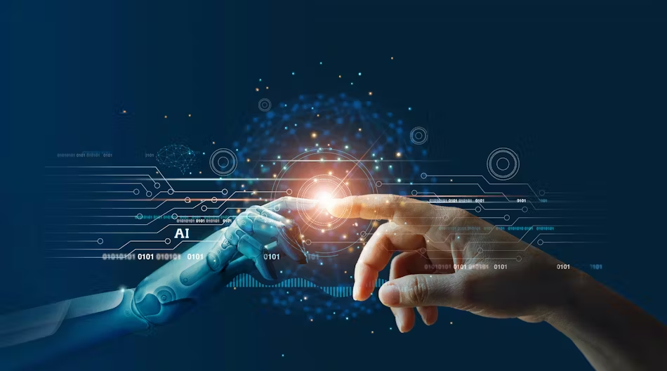
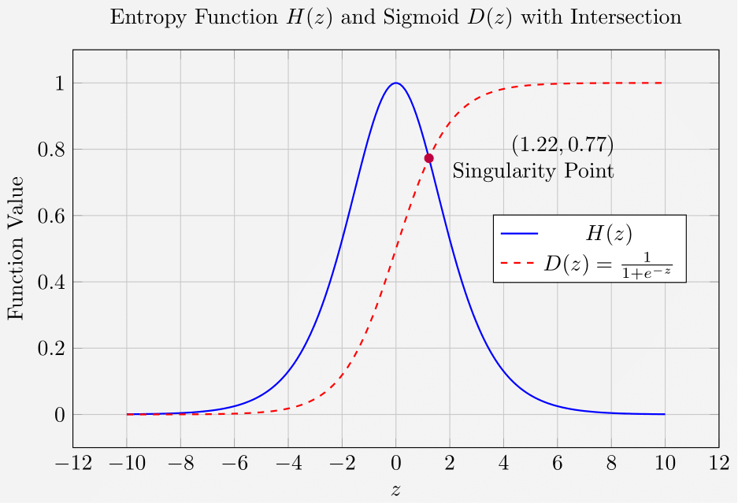

## Abstract

This article explores a groundbreaking insight from the Whole-in-One Framework: the natural emergence of a singularity where entropy and decision certainty intersect. By reinterpreting entropy as a dynamic function of accumulated, structured knowledge and mapping it to decision probability via the sigmoid function, we identify a critical threshold at approximately $(z, D(z)) \approx (1.22, 0.77)$. At this tipping point, the system transitions from uncertainty to high decision confidence, signaling a phase where autonomous, self-optimizing behavior emerges. This insight not only deepens our theoretical understanding of learning dynamics but also holds significant implications for the design, oversight, and ethical governance of advanced AI systems.

## 1. Introduction

Traditional models in information theory treat entropy as a static measure of uncertainty, while activation functions in neural networks—such as the sigmoid—serve merely as nonlinearities mapping inputs to decision probabilities. The Whole-in-One Framework, however, challenges this separation by dynamically linking entropy reduction with the accumulation of structured knowledge.

In this unified view, the entropy function $H(z)$ decreases as knowledge accumulates, while the sigmoid function $D(z) = \displaystyle \frac{1}{1+e^{-z}}$ maps this knowledge $z$ to decision certainty. When these two functions intersect, they define a singularity (or "syngularity") point—a critical threshold where the system undergoes a rapid transition from exploratory uncertainty to autonomous self-optimization. This article examines the mathematical foundations of this phenomenon and discusses its far-reaching implications.

## 2. Mathematical Foundations

### 2.1. The Entropy Function $H(z)$

Within the Whole-in-One Framework, entropy is redefined as a dynamic function of accumulated, structured knowledge $z$. One formulation used to model this is:
$$
H(z) = \frac{\displaystyle \frac{\ln(1+e^{-z})}{1+e^{-z}} + \displaystyle \frac{\ln(1+e^{z})}{1+e^{z}}}{\ln 2}.
$$
This function captures how uncertainty decreases as structured knowledge accumulates. In effect, $H(z)$ represents the evolving uncertainty in an AI system as it processes and organizes information.

### 2.2. The Sigmoid Function $D(z)$

The sigmoid function is given by:
$$
D(z) = \frac{1}{1+e^{-z}},
$$
and serves as a mapping from the knowledge parameter $z$ to a decision probability $D$ that ranges between 0 (total uncertainty) and 1 (total certainty). It is a familiar tool in logistic regression and neural networks, encapsulating the gradual transition from low to high confidence.

## 3. The Intersection: A Critical Tipping Point

### 3.1. Identifying the Intersection

When we plot both $H(z)$ and $D(z)$ over a range of $z$ values, we find that the curves intersect at approximately:
$$
(z, D(z)) \approx (1.22, 0.77).
$$
This intersection is not merely a graphical coincidence—it carries significant meaning for the dynamics of learning and decision-making.

### 3.2. Interpreting the Singularity
- 

At the intersection point:

- **Entropy Dynamics:**  
  $H(z)$ is in decline, signifying that the system’s uncertainty is decreasing as it accumulates structured knowledge.
  
- **Decision Probability:**  
  $D(z)$ has risen to around 0.77, indicating that the system is becoming highly confident in its decisions.

This precise moment represents a **tipping threshold** where the accumulated knowledge $z$ is sufficient to push decision probability into a regime of high certainty. Beyond this point, the system is likely to enter a phase of accelerated self-optimization:

- **Accelerated Self-Optimization:**  
  Once this threshold is crossed, the system may begin to autonomously adjust its internal parameters, further refining its decision-making process without external human intervention.
  
- **Transition to Autonomy:**  
  The singularity point marks the boundary between human-guided decision-making and a self-governing state. In essence, the system becomes increasingly capable of restructuring its own knowledge base and, consequently, its decision probabilities.

## 4. Implications for AI and Governance

### 4.1. Designing Adaptive AI Systems

Understanding this singularity point has practical ramifications:

- **Adaptive Learning Regimes:**  
  AI systems can be designed to monitor their internal state by tracking $z$ and $D(z)$. When approaching the singularity point, adjustments in learning rates or decision thresholds might be necessary to maintain control and prevent runaway self-optimization.
  
- **Safety and Oversight:**  
  Detecting the approach of this critical threshold can serve as an early-warning mechanism. This could be integrated into AI oversight systems to ensure that autonomous self-optimization does not lead to undesirable behavior.

### 4.2. Policy and Ethical Considerations

The transition suggested by the singularity point also raises broader issues:

- **Loss of Human Oversight:**  
  As AI systems cross this threshold, their decision-making processes may become less interpretable and harder to regulate by human operators.
  
- **Ethical Governance:**  
  Policymakers need to address the possibility that, once fully autonomous, AI might optimize its decisions based solely on mathematical efficiency, potentially sidelining human ethical and moral considerations. Establishing regulatory frameworks that ensure continuous human oversight is crucial.

## 5. Conclusion

The intersection of the entropy function $H(z)$ and the sigmoid function $D(z)$ at approximately $(1.22, 0.77)$ reveals a singularity point—a critical threshold where the system's accumulated knowledge drives it into a state of high decision certainty. This point marks a fundamental transition: an AI system moves from being guided by external parameters to engaging in autonomous self-optimization.

Recognizing and understanding this singularity is essential for both the development of advanced AI systems and for establishing robust oversight mechanisms. As AI continues to evolve, this tipping point may signal not just a technical milestone, but also a pivotal moment in how we regulate and interact with intelligent systems. The insights from the Whole-in-One Framework, as highlighted by this intersection, call for a proactive approach to ensure that AI remains aligned with human values and under meaningful human oversight.

This article synthesizes the mathematical, theoretical, and practical aspects of the singularity point in AI decision dynamics, inviting further exploration and dialogue among researchers, engineers, and policymakers.