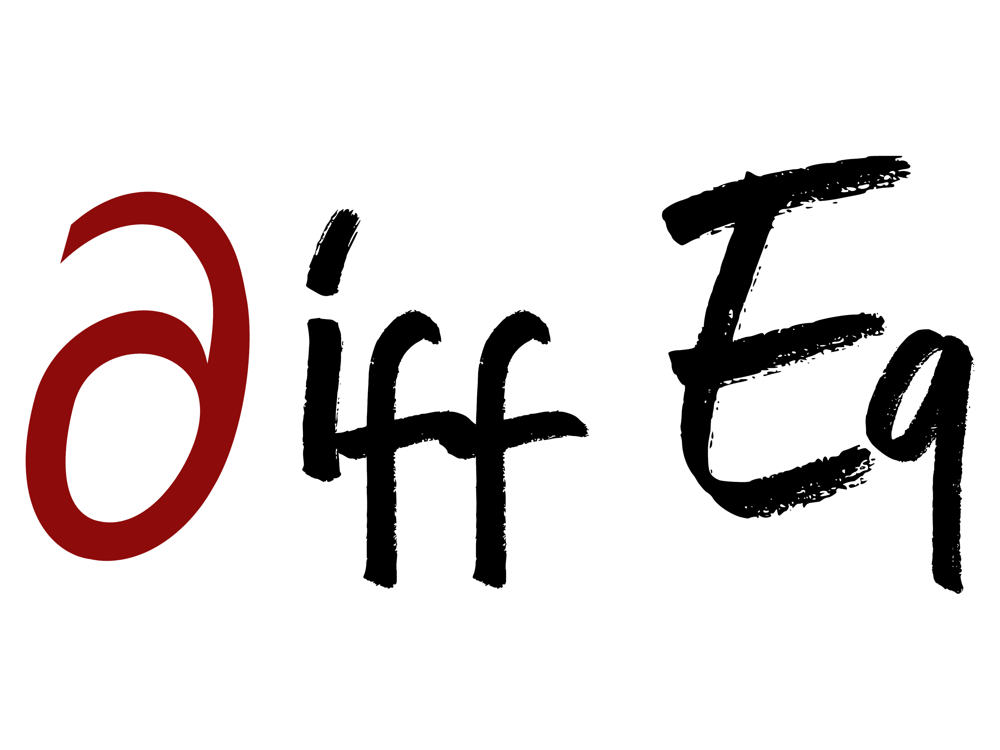

 

 # Learning with Raw Data vs. ODE Time Series Transform

<h2>Introduction</h2>

In real-world systems, data is often noisy and lacks structure. However, many processes are governed by **specific differential equations** that describe their behavior. By leveraging these equations, we can transform raw time series data into structured features that improve learning efficiency for machine learning (ML) models.

This article compares two approaches:

1. **Learning directly with raw data**.
2. **Learning with the ODE Time Series Transform**, which embeds system dynamics into the data.

<h2>Hypothesis</h2>

We hypothesize that the real-world process can be described by a known differential equation. This hypothesis serves as the foundation for the ODE Time Series Transform.

<h2>Workflow</h2>

### **1. Input Raw Data** 
Start with noisy real-world time series data.

### **2. ODE Time Series Transform**  

Transform the raw data using the hypotesized differential equation. This involves:

- Computing dynamic parameters.
- Generating structured features.

The transformed series becomes a new **feature** for the ML model.

### **3. Data Preparation**  

Prepare both the **raw data** and **transformed data**:

- Use a **sliding window** technique to create input-output pairs for training.

### **4. Train Machine Learning Models**  
Train a simple ML model (e.g., feedforward neural network) on:

1. **Raw Data**: Use the original time series directly.
2. **ODE Transformed Data**: Use the transformed features generated by the ODE.

### **5. Compare Results**  
Evaluate and compare the performance of both models:

- **Visualize Predictions**: Plot the model outputs against true values.
- **Quantitative Metrics**: Compare errors (e.g., Mean Squared Error).

<h2>Key Insights</h2>

1. The **ODE Time Series Transform** embeds domain knowledge into the data, improving signal-to-noise ratio and learning efficiency.  
2. Models trained on transformed data converge faster and generalize better for systems with underlying periodic or oscillatory behaviors.  
3. The transformation provides structured and interpretable features, reducing the burden on the ML model.

<h2>Conclusion</h2>

By combining domain knowledge (governing ODEs) with machine learning, the **ODE Time Series Transform** offers a powerful feature engineering method that outperforms learning with raw data. This approach is particularly valuable for systems exhibiting cyclic or oscillatory dynamics, such as in finance, biology, or engineering.
